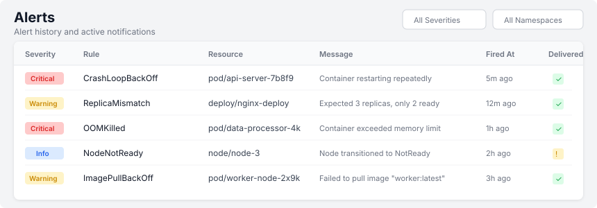

# Alerts

## Alert History

The alerts page shows all fired alerts with:
- **Severity** — Info (blue), Warning (yellow), Critical (red)
- **Rule** — Which alert rule was triggered
- **Resource** — The Kubernetes resource that triggered the alert
- **Namespace** — Resource namespace
- **Message** — Human-readable description of the issue
- **Fired At** — When the alert was triggered
- **Status** — Delivery status (Pending, Delivered, Failed, Cooldown)

## Alert Rules

View configured alert rules at `/alerts/rules`. Each rule shows:
- Name, type, severity, enabled status, cooldown period, namespace filter

See [Alert Rules Reference](../alerting/rules.md) for details on built-in rules.

## Webhooks

View configured webhook endpoints at `/alerts/webhooks`. Each endpoint shows:
- Name, URL, enabled status, retry count, timeout

See [Webhook Configuration](../alerting/webhooks.md) for integration examples.

## Common Alert Scenarios

### CrashLoopBackOff (Critical)
A container is crashing and being restarted repeatedly.
**Action**: Check pod logs for the crash reason. Common causes: missing config, bad image, OOM.

### OOMKilled (Critical)
A container exceeded its memory limit and was killed.
**Action**: Increase memory limits in the deployment spec, or investigate memory leaks.

### ImagePullBackOff (Warning)
Kubernetes cannot pull the container image.
**Action**: Check image name/tag, registry credentials, and network connectivity.

### Node Not Ready (Critical)
A cluster node has become unresponsive.
**Action**: Check node conditions, kubelet logs, and network connectivity. May need to drain and investigate.

### Deployment Replicas Mismatch (Warning)
A deployment has fewer available replicas than desired.
**Action**: Check pod status for the deployment. May be waiting for resources, failing health checks, or stuck in pending.
