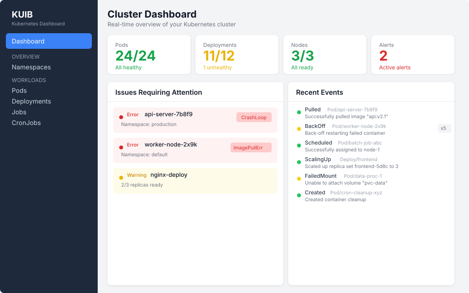
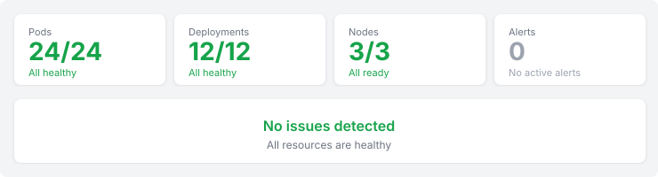

# Dashboard

The dashboard is the landing page of KUIB, providing an at-a-glance overview of your cluster's health.

## Stats Cards

The top row shows four key metrics:

- **Pods** — Running/Total count. Red when pods have failed, green when all healthy.
- **Deployments** — Healthy/Total count. Yellow when some deployments have replica mismatches.
- **Nodes** — Ready/Total count. Red when nodes are not ready.
- **Alerts** — Count of alerts fired in the last hour. Red when active, gray when clear.

Stats auto-refresh every 5 seconds via HTMX.

When all metrics are green, the dashboard shows a healthy cluster state:

## Issues Panel

The left panel highlights resources needing attention:
- Pods in error or warning state (CrashLoopBackOff, Failed, ImagePullBackOff)
- Deployments with unhealthy status (replica mismatches, rollout failures)

Each entry links to its detail page for investigation. When all resources are healthy, a green "No issues detected" message is shown.

## Recent Events

The right panel shows the 20 most recent Kubernetes events across all namespaces:
- Green dot: Normal events
- Yellow dot: Warning events
- Event reason, object reference, and message are displayed
- Repeat count shown for recurring events

Events auto-refresh every 5 seconds.

## Navigation

Use the sidebar to navigate to any resource type. The sidebar groups resources into:
- **Overview** — Dashboard, Namespaces
- **Workloads** — Pods, Deployments, StatefulSets, DaemonSets, Jobs, CronJobs
- **Networking** — Services, Ingresses
- **Infrastructure** — Nodes, Events
- **Configuration** — ConfigMaps, Secrets, PVCs
- **Alerting** — Alert history, Rules, Webhooks
