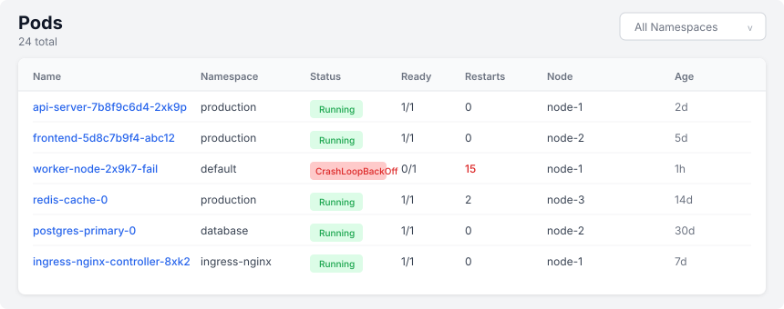
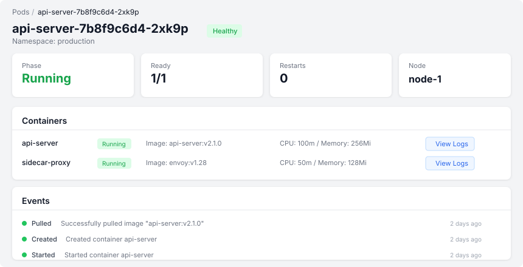

# Pods

## Pod List

The pod list page shows all pods across the cluster with:
- **Name** — Links to the pod detail page
- **Namespace** — Which namespace the pod belongs to
- **Status** — Phase badge (Running, Pending, Succeeded, Failed)
- **Ready** — Ready container count vs total (e.g., 2/3)
- **Restarts** — Total restart count across all containers. Red when > 5.
- **Node** — Which node the pod is scheduled on
- **Age** — When the pod was started

### Filtering
Use the namespace dropdown in the top-right to filter by namespace. The filter updates the list via HTMX without a full page reload.

### Live Updates
The pod list auto-refreshes every 5 seconds to reflect the latest state.

## Pod Detail

Click any pod name to see its detail page:

### Metadata
- Namespace, node, owner (ReplicaSet, Job, etc.), start time

### Labels
- All Kubernetes labels displayed as badges

### Status
- Phase, container count, ready count, total restarts

### Containers
Each container shows:
- Ready indicator (green/red dot)
- Container name and image
- State badge (Running, Waiting with reason, Terminated with exit code)
- Restart count

### Logs
1. Select a container from the dropdown
2. Click "Load Logs" to fetch the last 200 lines
3. Logs render in a monospace terminal-style viewer
4. Use the API endpoint for streaming: `GET /api/pods/{namespace}/{name}/logs`

### Historical Logs
If the pod has terminated and its logs were archived, access them via:
`GET /api/pods/{namespace}/{name}/logs/history`

### Events
Pod-specific Kubernetes events are shown at the bottom.
